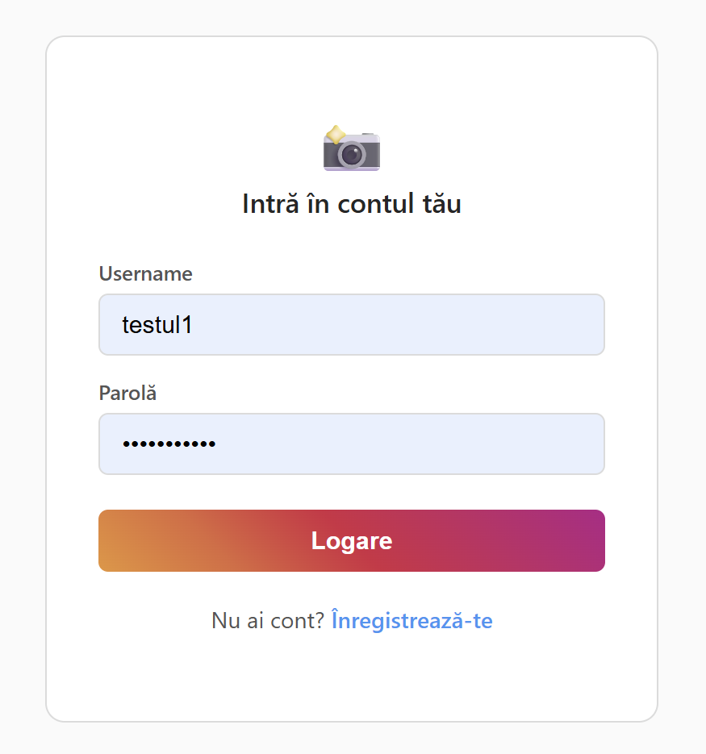
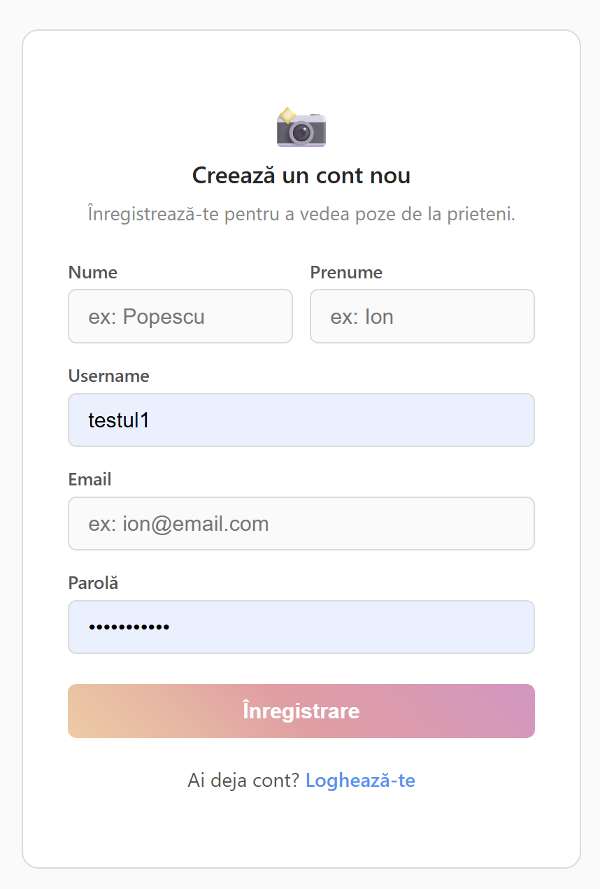
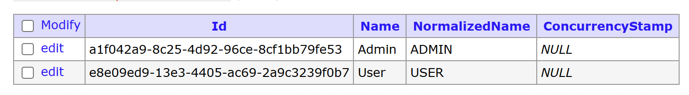
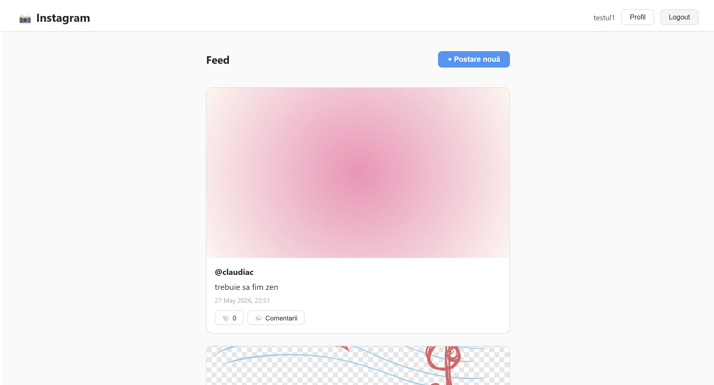
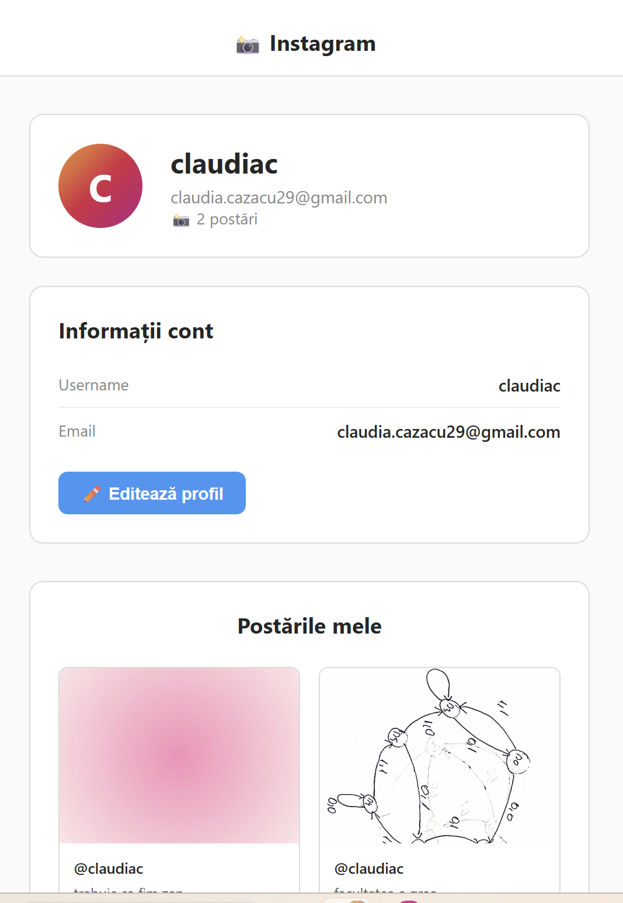
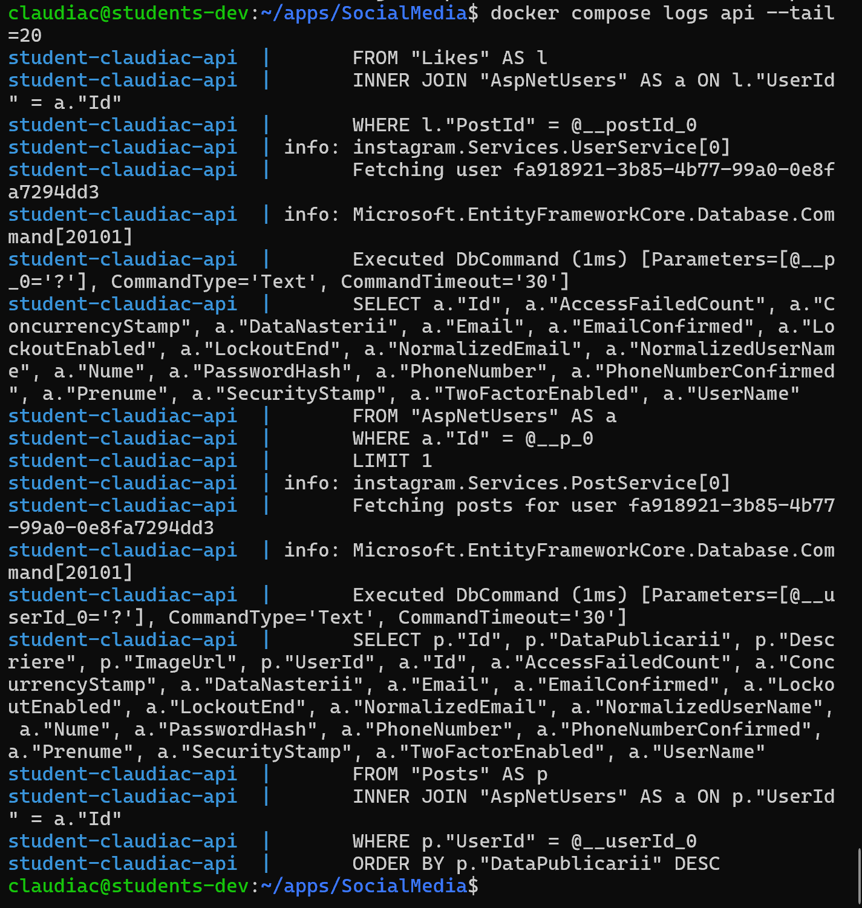

# Social Media App - ASP.NET Web Core API + Frontend Angular

Un proiect care simuleaza functionalitatile de baza ale unei aplicatii de socializare, precum Instagram. Acesta implementeaza o arhitectura pe straturi si include un sistem complet de atentificare - autorizare - gestionare a continutului.

## Functionalitati
* **Atentificare si securitate:** Sistem de login si register securizat, folosind un JWT.
  
  
* **Sistem de roluri:** Acces restrictionat in functie de rolul contului- useri normali, dar si un admin pentru moderarea continutului
  <br/>
  
* **Operatii CRUD:** Pentru gestionarea postarilor/comentariilor/like urilor/ urmaritorilor
   
  
* **Logging** Sistem de jurnal pentru erori si activitatile APiului
  

## Rulare

### Pe server (productie)
Aplicatia este deployata pe [https://claudiac.student-dev.ro](https://claudiac.student-dev.ro) folosind Docker.

Pentru a face update dupa modificari:
```bash
ssh claudiac@student-dev.ro
cd ~/apps/SocialMedia
git pull
docker compose up -d --build
```

### Local (development)
**Prerequisite:** .NET 9 SDK, Node.js 20+, PostgreSQL

**Backend:**
```bash
cd backend
dotnet restore
dotnet run
# API disponibil la http://localhost:5233
# Swagger la http://localhost:5233/swagger
```

**Frontend:**
```bash
cd frontend
npm install
ng serve
# Aplicatia disponibila la http://localhost:4200
```

### Cont implicit (creat automat la prima pornire)
| Username | Parola | Rol |
|---|---|---|
| admin_super | admin123 | Admin |

## Tehnologii
* **Backend** C# ASP.NET Core Web API
* **DB** PostgreSQL
* **ORM** Entity Framework Core
* **Arhitectura** N-tier (Controllers-Services-Repositories)
* **Securitate** JWT, ASP.NET Core Identity

## Structura 

### Principala
* `/Controllers` - Expunerea endpoint-urilor
* `/Services` - Logica de business si validari
* `/Repositories` - Interogarile catre DB
* `/DTOs` - DTOs pentru comunicarea client-server
* `/Middlewares` - Componente care intercepteaza cererile clientului dar si raspunsurile serverului

### Completa:
```
instagram/
├── backend/                          # ASP.NET Core Web API
│   ├── Controllers/
│   │   ├── AuthController.cs         # Login, Register
│   │   ├── CommentsController.cs     # CRUD comentarii
│   │   ├── FollowController.cs       # Urmarire useri
│   │   ├── LikesController.cs        # Like/Unlike postari
│   │   ├── PostControllers.cs        # CRUD postari
│   │   ├── RepostsController.cs      # Repostare
│   │   ├── TagsController.cs         # Taguri postari
│   │   ├── UploadController.cs       # Upload imagini
│   │   └── UsersController.cs        # Gestionare useri
│   ├── Data/
│   │   ├── AppDbContext.cs           # Contextul EF Core
│   │   └── SeedData.cs              # Date initiale (admin, roluri)
│   ├── DTOs/
│   │   ├── LoginDto.cs
│   │   ├── RegisterDto.cs
│   │   ├── CreatePostDto.cs
│   │   ├── PostReadDto.cs
│   │   ├── UpdatePostDto.cs
│   │   ├── UserReadDto.cs
│   │   ├── UserCreateDto.cs
│   │   ├── UpdateUserDto.cs
│   │   ├── CommentsDtos.cs
│   │   ├── FollowsDtos.cs
│   │   ├── LikesDtos.cs
│   │   └── RepostsDtos.cs
│   ├── Mappings/
│   │   ├── CommentMappings.cs
│   │   ├── FollowMappings.cs
│   │   ├── LikeMapping.cs
│   │   ├── PostMappings.cs
│   │   └── RepostMappings.cs
│   ├── Middlewares/
│   │   └── GlobalExceptionMiddleware.cs  # Gestionare globala erori
│   ├── Migrations/                   # Migrarile EF Core
│   ├── Models/
│   │   ├── ApplicationUser.cs        # Utilizator (Identity)
│   │   ├── Comment.cs
│   │   ├── Follow.cs
│   │   ├── Like.cs
│   │   ├── Post.cs
│   │   ├── Repost.cs
│   │   └── Tag.cs
│   ├── Repositories/
│   │   ├── IPostRepository.cs / PostRepository.cs
│   │   ├── ICommentRepository.cs / CommentRepository.cs
│   │   ├── ILikeRepository.cs / LikeRepository.cs
│   │   ├── IFollowRepository.cs / FollowRepository.cs
│   │   ├── IRepostRepository.cs / RepostRepository.cs
│   │   └── IUserRepository.cs / UserRepository.cs
│   ├── Services/
│   │   ├── IPostService.cs / PostService.cs
│   │   ├── ICommentService.cs / CommentService.cs
│   │   ├── ILikeService.cs / LikeService.cs
│   │   ├── IFollowService.cs / FollowService.cs
│   │   ├── IRepostService.cs / RepostService.cs
│   │   └── IUserService.cs / UserService.cs
│   ├── wwwroot/images/               # Imagini uploadate de useri
│   ├── Program.cs                    # Entry point, configurare servicii
│   ├── appsettings.json
│   └── Dockerfile
├── frontend/                         # Angular SPA
│   └── src/
│       ├── app/
│       │   ├── core/
│       │   │   ├── guards/
│       │   │   │   └── auth.guard.ts         # Protectie rute
│       │   │   ├── interceptors/
│       │   │   │   └── auth.interceptor.ts   # Atasare JWT la request-uri
│       │   │   ├── models/
│       │   │   │   ├── auth.models.ts
│       │   │   │   └── post.models.ts
│       │   │   └── services/
│       │   │       ├── auth.service.ts
│       │   │       ├── post.service.ts
│       │   │       └── user.service.ts
│       │   └── features/
│       │       ├── auth/
│       │       │   ├── login/                # Pagina Login
│       │       │   └── register/             # Pagina Register
│       │       ├── posts/
│       │       │   ├── post-list/            # Feed principal
│       │       │   └── post-detail/          # Detalii postare + comentarii
│       │       └── profile/                  # Profil utilizator
│       └── environments/
│           ├── environment.ts                # Local (localhost:5233)
│           └── environment.production.ts     # Productie (/api)
├── docs/screenshots/                 # Screenshots pentru README
├── docker-compose.yml                # Orchestrare containere
├── .env.example                      # Template variabile de mediu
└── README.md
```